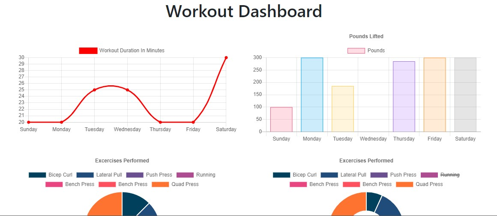

# Workout-tracker
This is a workout tracker application. This app allows the user to View, create and track their daily workout. User can log multiple exercises, track the name, type, weight, sets, reps, and duration of exercise. When the user chooses the cardio exercise, the user can be able to track the distance traveled.

Technology used: HTML, CSS, Javascript, node packages, express, mongoDb and mongoose.

Deployed Link:(https://quiet-gorge-37627.herokuapp.com/)

